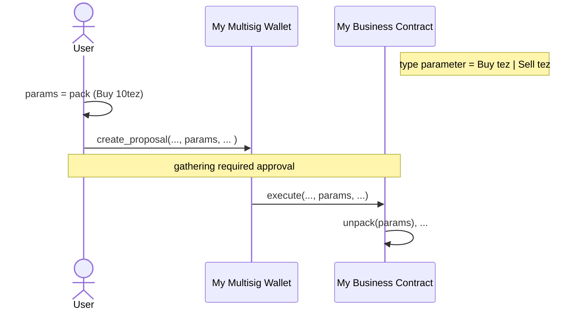

# Multi-signature
Multi-signature (also multisig) wallet allows to share the ownership of an account by a smart contract. Each owner, also called signer, can create a proposal to propose transferring Tez or executing other contracts. Signer provides approval stored on-chain by performing Tezos transaction. Once gathering the minimal approvals, the multisig will perform the proposal.

# Requirements
The contract is written in cameligo. Please follow [the instructions of installation in LIGO](https://ligolang.org/docs/intro/introduction?lang=cameligo).

The minimal required version can be found by performing `make ligo-version`.

# Usage
To create a multisig wallet, you can use the default contracts that we provided or customize by yourself.

If the purpose is to transfer Tez in and out only, the `app/main_unit.mligo` is recommended. Please run `make build` to compile the contract in Michelson which can be found in `_build/app/multisig_unit.tez`. See the Deploy section for the origination of the contract.

On the other hand, if executing other contracts is required, you can either use `app/main_bytes.mligo` or the multisig library to customize your own.

In the case of using `app/main_bytes.mligo`, you need to `pack` a parameter of the target contract as bytes and include it while creating a proposal. Once the minimal approvals are gathered, multisig will start executing the target contract. The target contract needs to `unpack` bytes by itself to get meaningful data.



Last, if you want a unpacked type, customizing your wallet is possible. First, in `package.json`, add `multi-signature` library in dependencies. In the library, we provide `contract` function with type variable `a`.

```
let contract (type a) (request : a parameter_types * a storage_types) : a result = ...
```
where `a` is the type of your contract parameter. You will need to use the function to define an entry of multisig. For example,

```ocaml
#import "ligo-multisig/src/lib.mligo" Multisig

type action
  = Action1 of nat
  | Action2 of string

(* your main entry *)
let main (input : action * storage) : operation list * storage =

(* the multisig entry *)
let multisig (input : action Multisig.parameter_types * action Multisig.storage_types) : action Multisig.result =
  Multisig.contract input
```
Finally, compile the contracts with LIGO.

```bash
# compile your contract
ligo compile contract your_contract.mligo --entry-point main

# compile multisig contract
ligo compile contract your_contract.mligo --entry-point multisig
```

# Deploy
We provide several steps for quick deploying contracts in `app/` to ghostnet.

1. build contracts by performing `make build`
1. run `make get-tezos-binary` to get tezos-client binary
1. run `make gen-wallet` to generate an implicit account. The account information will show up.
1. go [faucet](https://faucet.marigold.dev/) to request some XTZ.
1. run `make deploy` to deploy contracts

# TODO
- reset settings, such as threshold, signers, etc
- support a different kind of threshold
- support a batch transaction
- support FA2.1
- support views and events
