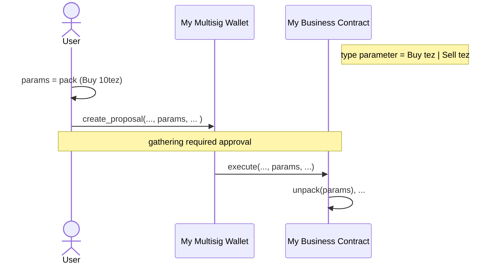

# TzSafe
Tzsafe is a multisig wallet aiming at providing better assurance of security and management of ownership than a traditional single-signed wallet.

Multi-signature (also multisig) wallet allows to share the ownership of an account by a smart contract. Each owner can create a proposal to propose transferring Tez or executing other contracts. Signer provides approval stored on-chain by performing Tezos transaction. Once gathering the minimal approvals, the multisig will perform the proposal.

# Requirements
The contract is written in cameligo. Please follow [the instructions of installation in LIGO](https://ligolang.org/docs/intro/introduction?lang=cameligo).

The minimal required version can be found by performing `make ligo-version`.

# Usage
## Create multisig wallet

To create a multisig wallet, you can use the default contracts that we provided or customize by yourself.

If purpose is to transfer Tez in and out only, the `app/main_unit.mligo` is recommended. Please run `make build` to compile the contract in Michelson which can be found in `_build/app/multisig_unit.tez`. See the Deploy section for the origination of the contract.

On the other hand, if executing other contracts is required, you can either use `app/main_bytes.mligo` or the multisig library to customize your own.

In the case of using `app/main_bytes.mligo`, you need to `pack` a parameter of the target contract as bytes and include it while creating a proposal. Once the minimal approvals are gathered, multisig will start executing the target contract. The target contract needs to `unpack` bytes by itself to get meaningful data.



Last, if you want a unpacked type, customizing your wallet is possible. First, in `package.json`, add `multi-signature` library in dependencies. In the library, we provide `contract` function with type variable `a`.

```
let contract (type a) (request : a parameter_types * a storage_types) : a result = ...
```
where `a` is the type of your contract parameter. You will need to use the function to define an entry of multisig. For example,

```ocaml
#import "ligo-multisig/src/lib.mligo" Multisig

type action
  = Action1 of nat
  | Action2 of string

(* your main entry *)
let main (input : action * storage) : operation list * storage =

(* the multisig entry *)
let multisig (input : action Multisig.parameter_types * action Multisig.storage_types) : action Multisig.result =
  Multisig.contract input
```
Finally, compile the contracts with LIGO.

```bash
# compile your contract
ligo compile contract your_contract.mligo --entry-point main

# compile multisig contract
ligo compile contract your_contract.mligo --entry-point multisig
```

Note that the `Execute_lambda` is also provided another solutions for executing other contracts.

## Entrypoints of multisig

### default
This entrypoint can receive Tez from any source.
- Emit event
  - tag: `default`
  - data: `(sender, address)`

### create_proposal
Each owner can create proposal through this entrypoint. The entrypoint supports creating a batch of transactions. The batch is atomic and execution by order. If modifing settings are proposed, the modified setting will NOT apply in this batch immediately. The setting will effect on a next batch/transaction.

- proposal that owner can create
  - `Transfer of { target:address; parameter:unit; amount:tez}`
     - transfer amount only
  - `Execute of { target:address; parameter:'a; amount:tez}`
     - execute contract with type of parameter `'a`
  - `Execute_lambda of { metadata: bytes option; lambda: (unit -> operation)}`
     - execute lambda, note that the cost of using `Transfer` and `Execute`is cheaper than `Execute_lambda`
  - `Adjust_threshold of nat`
     - adjust threshold. the threshold should be >0. Otherwises, errors will occur.
  - `Add_owners of address set`
     - add owners
  - `Remove_owners of address set`
     - remove owners

- Emit event
  - tag: `create_proposal`
  - data: `(proposal id, created proposal)`

### sign_and_resolve_proposal
Signers can provide an approval or a disapproval through this entrypoint. The owner who is statisfied the minimal requestment of approvals will also trigger the execution of proposal. After the proposal has been resolved, owners can not provide their approvals.

- Emit event
  - tag: `sign_proposal`
  - data: `(proposal id, owner, agreement)`
  - tag: `resolve_proposal` (only when proposal is resolved)
  - data: `(proposal id, owner)`

# sign_proposal_only
Signers can provide an approval or a disapproval through this entrypoint. Unlike `sign_and_resolve_proposal`, the proposal won't be resolve in any case.

- Emit event
  - tag: `sign_proposal`
  - data: `(proposal id, owner, agreement)`

# resolve_proposal
Signers can resolve proposal when minimal requestment is statisfied.

- Emit event
  - tag: `resolve_proposal`
  - data: `(proposal id, owner)`

# Deploy
We provide several steps for quick deploying contracts in `app/` to ghostnet.

1. build contracts by performing `make build`
1. run `make get-tezos-binary` to get tezos-client binary
1. run `make gen-wallet` to generate an implicit account. The account information will show up.
1. go [faucet](https://faucet.marigold.dev/) to request some XTZ.
1. run `make deploy` to deploy contracts

# TODO
- support a different kind of threshold
- support FA2.1
